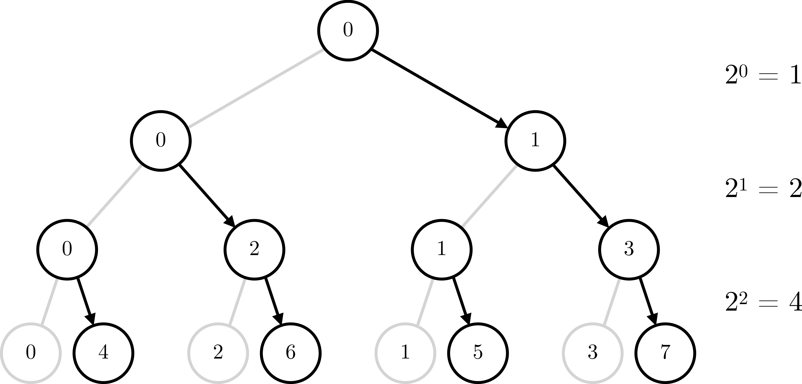

(Circles with numbers are MPI ranks. Black arrows indicate communication between ranks. Grey lines are visual supplements to indicate the full tree structure.)

Instead of having the master send data to each MPI rank individually, one after another, we utilize the fact that after a send/receive the data is present on another MPI rank which can itself pass the data on to another rank. Example from the image: once MPI rank 1 has received the data from rank 0 it will pass it on to rank 3 (and afterwards also to rank 5). The master (rank 0) thus never has to communicate with rank 3 (or 5) directly.